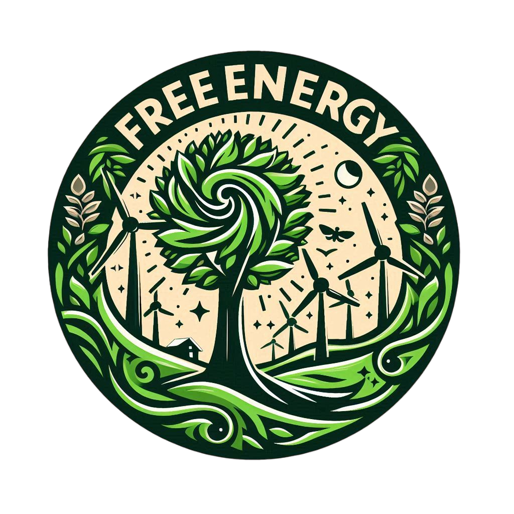

# 🌲 Free Energy

**Um projeto que incentiva o uso de árvores como fonte de energia renovável.**

# 🌍 Descrição:

-   Free Energy é um projeto que propõe o uso de árvores como fonte de energia renovável. Este website explora a captura da energia gerada pelo movimento das árvores, como a oscilação de suas folhas ao vento. Ao empregar tecnologias sustentáveis, buscamos transformar esse movimento natural em energia elétrica, oferecendo uma alternativa ambiental e visualmente harmônica com o ambiente ao nosso redor. Nosso objetivo é fornecer uma solução viável para a geração de energia elétrica e conscientizar a sociedade sobre a relevância de preservar o meio ambiente ao usá-lo de forma inteligente.

# 💡 Objetivos:

-   Incentivar o desenvolvimento de uma tecnologia que gere energia atraves do movimento das arvores.
-   Conscientizar que existe uma maneira de gerar energia renovável atraves das arvores sem ferir o meio ambiente e seu visual.

# 💻 Tecnologias aplicadas:

   

# 👨🏻‍💻 Integrantes:

-   **Gustavo Galdino Alexandre Cavalcante RA - 237052.**
-   **Gustavo Medeiros Barros dos Santos RA - 234858.**
-   **Neemias Aguiar de Mello RA - 237321.**

# 🛠️ Changelog:

-   Free Energy V.0.1.8 Adicionando a Pasta Global para adicionar configurações que serão usadas em todas as paginas, adicionando Global.Css para o codigo da fonte, Adicionando tambem o JavaScript global para para a animação das paginas, excluindo os JavaScripts individuais desnecessarios, Excluindo a pasta img e movendo as imagens para assets/img.

-   Free Energy V.0.1.7 Debugando os caminho dos links e os cards da pagina Contatos, atualizando a pagina Home, Contatos e adicionando a pagina noticias.

-   Free Energy V.0.1.6 Atualização README e Saiba mais.

-   Free Energy V.0.1.5 Debugando As imagens do Saiba mais uma vez.

-   Free Energy V.0.1.4 Debugando As imagens do Saiba mais denovo.

-   Free Energy V.0.1.3 Debugando As imagens do Saiba mais.

-   Free Energy V.0.1.2 Debugando As imagens da Home.

-   Free Energy V.0.1.1 Pagina Home e Contatos modificadas.

-   Free Energy V.0.1.0 Pagina saiba mais concluida.

-   Free Energy V.0.0.9 Atualização logo do README.

-   Free Energy V.0.0.8 Atualização do README.

-   Free Energy V.0.0.7 Reorganizando algumas paginas e Começando a estilizar A Home Page.

-   Free Energy V.0.0.6 Criada pagina saiba mais.

-   Free Energy V.0.0.5 Começando a criar o site com base no modelo feito no figma, adicionando cabeçalho, adicionando logo, adicionando plano de fundo e criando uma pasta e arquivo para javaScript.

-   Free Energy V.0.0.4 Criação de uma pagina adicional chamada "Informacoes_participantes.html" para colocar mais informações dos integrantes com um icone no final da pagina, adicionando mais icones no css, adicionando mais anotações dentro do codigo para melhor acesso e organização.

-   Free Energy V.0.0.3 adicionando os integrantes e seus links no final da pagina, reorganizando o codigo e adicionando anotações dentros do codigo para melhor acesso e organização.

-   Free Energy V.0.0.2 Colocando Mais coisas provisorias e dando inicio a algumas coisas.

-   Free Energy V.0.0.1 Colocando algumas coisas provisorias.
